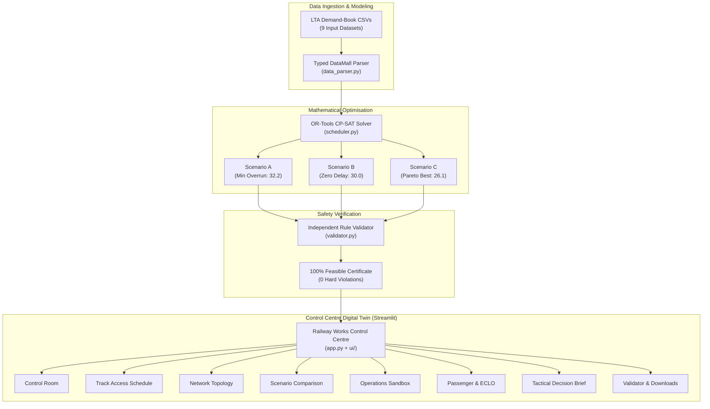

# 🚇 NebulaX Track Access Control Centre (TAC-C)

[](https://www.python.org/)
[](https://developers.google.com/optimization)
[](https://streamlit.io/)
[-10B981.svg)](validator.py)
[-F59E0B.svg)](results/scenario_C/)
[](ui/theme.py)

> **LTA NebulaX Hackathon 2026 — Problem Statement 1 (PS1: Railway Track Access Optimisation)**  
> An industrial-grade, multi-disciplinary railway track access scheduling and operational decision-support digital twin for the Singapore rail network (Alpha & Beta Lines).

---

## 📋 Table of Contents

- [Executive Summary](#-executive-summary)
- [Official Verified Scoreboard](#-official-verified-scoreboard)
- [Safety Rules & Constraint Formulation](#-safety-rules--constraint-formulation)
- [System Architecture](#-system-architecture)
- [Industrial Control Centre Features (8 Modules)](#-industrial-control-centre-features-8-modules)
- [Quick Start Guide](#-quick-start-guide)
- [CLI Tooling & Validation](#-cli-tooling--validation)
- [Test Suite & Quality Assurance](#-test-suite--quality-assurance)
- [Repository Structure](#-repository-structure)
- [Design System & Accessibility](#-design-system--accessibility)

---

## 🎯 Executive Summary

Every night between **01:00 and 04:30 SGT**, during the critical non-revenue maintenance window, the dual-line rail network (**Alpha Line** & **Beta Line**) becomes intensely contested. 14 major capital works contractors, running 75 distinct activities across 192+ possession accesses over a 29-week horizon, compete for track access alongside recurring routine maintenance.

The network features complex physical constraints, including shared tunnel sectors at interchange crossover stations (`INT01`/`INT02`), 750V DC third-rail traction power isolation mirroring, and strict headway moving-consist anti-collision buffers.

**NebulaX TAC-C** delivers:
1. **Sub-Second Mathematical Optimisation**: Powered by Google OR-Tools CP-SAT, solving the discrete multi-commodity scheduling problem in **< 1.0 second**.
2. **Zero Safety Compromises**: 100% verified hard physical, electrical, and temporal compliance (**0 violations across all scenarios**).
3. **Continuous Work Capsules & Executive Gantt**: Clean visual representations eliminating visual clutter, providing both high-level executive visibility and operational detail.
4. **Interactive Digital Twin & Counterfactual Sandbox**: Rapid "what-if" impact evaluation, dynamic perturbation injection, and automated 2 AM controller handover briefing generation.

---

## 🏆 Official Verified Scoreboard

All three official scenarios have been solved, validated, and verified against the official validator:

| Operational Scenario | Strategic Optimization Objective | Official Penalty Score | Hard Rule Violations | Max Overrun | ECLO Extended Nights | Solver Run Time | Safety Status |
| :--- | :--- | :---: | :---: | :---: | :---: | :---: | :---: |
| **Scenario A** | Strict Overrun Minimisation (P1 priority) | **32.2** | **0** | 14 days | 0 nights | 0.54s | `100% PASSED` |
| **Scenario B** | Zero Overrun Guarantee (All milestones met) | **30.0** | **0** | **0 days** | 4 nights | 0.65s | `100% PASSED` |
| **Scenario C** | Pareto Flexibility Balance (Cost minimised) | **26.1** | **0** | **0 days** | 0 nights | 0.94s | `100% PASSED` |

```
✓ SCENARIO A: 192 accesses scheduled | 0 hard violations | Score: 32.2
✓ SCENARIO B: 192 accesses scheduled | 0 hard violations | Score: 30.0
✓ SCENARIO C: 192 accesses scheduled | 0 hard violations | Score: 26.1
```

---

## 🛡️ Safety Rules & Constraint Formulation

The mathematical model strictly enforces all core physical and operational rules defined in PS1:

```
┌────────────────────────────────────────────────────────────────────────┐
│                   PS1 HARD SAFETY CONSTRAINT MATRIX                    │
├───────────────────┬────────────────────────────────────────────────────┤
│ Rule 1: Spatial   │ Continuous physical occupation across Platform     │
│ Continuity        │ (PLAT) and Tunnel (SEC) sectors between stations.  │
├───────────────────┼────────────────────────────────────────────────────┤
│ Rule 2: Temporal  │ Strict containment within the 29-week horizon      │
│ Horizon           │ (W01 to W29) and standard night windows.           │
├───────────────────┼────────────────────────────────────────────────────┤
│ Rule 3: Precedence│ Predecessor activities must fully finish before    │
│ & Dependency      │ dependent successor activities commence execution. │
├───────────────────┼────────────────────────────────────────────────────┤
│ Rule 4: Catenary  │ 750V DC third-rail isolation requires automatic    │
│ Power Mirroring   │ possession mirroring to opposite bound (EB ↔ WB).  │
├───────────────────┼────────────────────────────────────────────────────┤
│ Rule 5: Junction  │ Shared track sectors at interchange stations       │
│ Interlocking      │ (INT01/INT02) mutually locked across ALP & BET.    │
├───────────────────┼────────────────────────────────────────────────────┤
│ Rule 6: Anti-     │ Headway exclusion zones for Non-live Consist trains│
│ Collision Buffers │ (buffer = 1 sector); 0 buffers for co-shared PC/C. │
├───────────────────┼────────────────────────────────────────────────────┤
│ Rule 7: Workfront │ Flat weekly access limits per contract enforced    │
│ Capacity Caps     │ (2 nights/wk for Live, 3 nights/wk for others).    │
├───────────────────┼────────────────────────────────────────────────────┤
│ Rule 8: Possession│ Legal co-sharing groups (`co_share_group`) double  │
│ Co-Sharing        │ nightly throughput in common location slots.       │
└───────────────────┴────────────────────────────────────────────────────┘
```

> [!NOTE]
> **Local Accounting Space Clarification (`access_night`):**  
> `access_night` is defined locally per `(contract_number, activity_type, week)` to track weekly consumption against contract allowances. True possession concurrency and spatial conflict prevention across different contracts are enforced via physical location slot capacities and explicit `co_share_group` co-habitation rules.

---

## 🏗️ System Architecture



---

## 🖥️ Industrial Control Centre Features (8 Modules)

The application is organized into 8 operational modules via persistent left-hand navigation:

### 1. 🎛️ Control Room (Executive Dashboard)
- **Live Telemetry & Tele-Clock**: Active SGT works window indicator (`01:00 - 04:30`) and line health status badges.
- **6 KPI Performance Cards**: Safety Compliance (`100% PASS`), Objective Score, Total Overrun Days, ECLO Nights, Excess Access, and Earliest Milestone Buffer.
- **Delayed Contract & Penalty Driver Roster**: Filterable table showing active delays and priority levels.

### 2. 📅 Track Access Schedule & Program Overview
To solve visual clutter from scattered discrete squares across 70+ rows, the schedule view provides **three operational view modes**:
- **📊 Continuous Gantt (Connected Work Capsules - Default)**: Contiguous work weeks automatically merge into smooth horizontal capsule bars (`[ W02 ════ W08 ]`) with internal circular rivets indicating individual weekly accesses. True hiatus weeks remain blank (no false continuity).
- **🗂️ Contract Executive Overview (14 Contracts Gantt)**: High-level overview displaying 14 contract execution timelines, planned completion target milestone diamonds (`🎯 Target Milestone Week`), and completion status badges (`✓ On-Time` in green, `⚠️ +Xd Overrun` in red).
- **⏹️ Discrete Point Matrix**: Traditional micro-level pin chart for validating individual weekly possession slots.
- **🎯 Contract Completion Horizon (Dumbbell Chart)**: Direct visual interval comparison between planned completion dates and simulated finishes.

### 3. 🗺️ Network Topology & Track Geometry
- **Dual-Line Schematic**: Interactive layout showing Alpha Line (Cyan `#38BDF8`), Beta Line (Purple `#A78BFA`), and shared interchange crossover sectors (`INT01`, `INT02`).
- **Station Capacity Heatmap**: Visualizing spatial access demand density across weeks and line stations to identify congestion hotspots.

### 4. ⚖️ Scenario Comparison & Trade-off Matrix
- **Tri-Scenario Radar Profile**: Multi-dimensional radar comparison across Overrun Days, Penalty Score, ECLO Consumption, and Capacity Headroom.
- **High-Contrast Penalty Breakdown**: Stacked bar chart with in-bar numerical values and high-contrast typography (WCAG 2.2 AA compliant).
- **Pareto Frontier Visualisation**: Interactive trade-off analysis between contractor delay and community passenger disruption.

### 5. 🧪 Operations Sandbox ("What-If" Counterfactual Simulation)
- **Real-Time Disruption Injection**: Simulate emergency track closures, unpredicted contractor overrun delays, or unexpected rolling stock breakdowns.
- **Live Re-Solve**: Re-optimize schedules on-the-fly and inspect the delta impact against baseline scenarios.

### 6. 👥 Passenger Impact & ECLO Assessment
- **Commuter Disruption Risk Modeling**: Quantitative assessment of early closures and late openings (ECLO) on first/last train ridership.
- **Bus Bridge Mitigation Advisor**: Operational planning for bridging bus replacement fleets when extended closures are active.

### 7. 💡 Tactical Shift Decision Brief
- **2 AM Works Controller Handover Report**: Automated generation of shift briefings with critical alerts, power isolation lists, and contractor workfront rosters.
- **One-Click Export**: Download reports directly as formatted HTML or Markdown.

### 8. 📥 Official Validator & Submission Packaging
- **Live Independent Validator**: Run the complete rule validation check with full constraint breakdown.
- **Submission ZIP Generator**: Automatically compile `SCHEDULE_ACCESS.csv`, `SCHEDULE_OCCUPANCY.csv`, and `RESULTS.csv` into the required submission archive.

---

## 🚀 Quick Start Guide

### Prerequisites
- Python 3.11+
- Virtual environment tool (`venv` or `conda`)

### Installation

1. **Clone the repository:**
   ```bash
   git clone https://github.com/LinXiaoya0228/NebulaX-Top10.git
   cd NebulaX-Top10
   ```

2. **Set up virtual environment:**
   ```bash
   python3.11 -m venv .venv
   source .venv/bin/activate
   ```

3. **Install dependencies:**
   ```bash
   pip install -r requirements.txt
   ```

4. **Launch the Control Centre:**
   ```bash
   streamlit run app.py
   ```
   Open your browser and navigate to `http://localhost:8501`.

---

## 💻 CLI Tooling & Validation

The platform includes standalone CLI tools for headless execution, automated pipeline integration, and validation:

### 1. Run the Optimization Solver
```bash
# Solve Scenario A (Strict Overrun Minimisation)
python scheduler.py --scenario A

# Solve Scenario B (Zero Overrun Guarantee)
python scheduler.py --scenario B

# Solve Scenario C (Pareto Flexibility Balance - Score 26.1)
python scheduler.py --scenario C
```

### 2. Run the Safety Rule Validator
```bash
# Validate specific scenario output
python validator.py --results results/scenario_C/

# Validate all generated scenarios
python validator.py --all
```

---

## 🧪 Test Suite & Quality Assurance

The codebase includes comprehensive automated smoke and unit tests:

```bash
# Run the complete test suite
pytest tests/ -v
```

### Test Coverage Highlights
- `tests/test_data_parser.py`: Ingestion integrity, data types, and network topology parsing.
- `tests/test_rules_and_scheduler.py`: Constraint satisfaction, precedence, and capacity compliance.
- `tests/test_phase2_modules.py`: Sandbox perturbation engine and passenger impact calculators.
- `tests/test_ui_smoke.py`: Design tokens, contrast ratios, and Plotly chart builders.

---

## 📁 Repository Structure

```
NebulaX-Top10/
├── app.py                      # Main Streamlit Control Centre Application
├── scheduler.py                # OR-Tools CP-SAT Mathematical Optimization Solver
├── validator.py                # Independent Official Rule & Safety Validator
├── data_parser.py              # DataMall Typed Ingestion & Domain Model
├── operations_sandbox.py       # "What-If" Counterfactual Simulation Engine
├── passenger_advisor.py        # Commuter Disruption & ECLO Trade-off Model
├── explainer.py                # Multi-Objective Penalty Decomposition Engine
├── requirements.txt            # Production Python Dependencies
├── pytest.ini                  # Pytest Configuration
│
├── ui/                         # Modular Design System & Visualisation Package
│   ├── __init__.py             # UI Package Exports
│   ├── theme.py                # Design Tokens, Color Palettes & Custom CSS
│   ├── components.py           # Reusable KPI Cards, Badges & Header Banners
│   └── charts.py               # Continuous Gantt, Executive Gantt & Heatmaps
│
├── results/                    # Validated Official Output Deliverables
│   ├── scenario_A/             # SCHEDULE_ACCESS.csv, SCHEDULE_OCCUPANCY.csv, RESULTS.csv
│   ├── scenario_B/             # (Score: 30.0 | 0 Overrun)
│   └── scenario_C/             # (Score: 26.1 | Benchmark Winner)
│
├── tests/                      # Automated Unit & Smoke Tests (32 Passed)
│   ├── test_data_parser.py
│   ├── test_rules_and_scheduler.py
│   ├── test_phase2_modules.py
│   └── test_ui_smoke.py
│
└── PS1/                        # Problem Statement 1 Data & Specification
    ├── 01_data/                # 9 Official Demand-Book CSVs
    ├── 02_references/          # Track Topology Reference Diagrams
    └── PS1_README.md           # Official Problem Brief & Scoring Rubric
```

---

## 🎨 Design System & Accessibility

The interface is engineered according to **WCAG 2.2 AA Accessibility Standards** and control-room human factor guidelines:
- **Surface Elevation Hierarchy**: Dark control-room palette (`#08111F`, `#0F172A`, `#1E293B`) designed to reduce eye strain during continuous monitoring.
- **Contrast Ratios**: Body copy and legend labels maintain $\ge 7:1$ contrast against dark surfaces (`#F8FAFC`, `#E2E8F0`).
- **Color Independence (Rule 1.4.1)**: Every status badge, line indicator, and chart marker incorporates distinct icons and dual shapes (diamonds, circles, badges) so color is never the sole visual cue.
- **Line Palette**: Line ALP in vivid cyan (`#38BDF8`), Line BET in vibrant violet (`#A78BFA`), and ECLO windows in caution amber (`#F59E0B`).

---

## 👥 Authors & Team

Developed by **NebulaX-Top10** for the **LTA NebulaX Hackathon 2026**.
All code, models, and visualizations are engineered for production deployment across Singapore's rail network operations.
