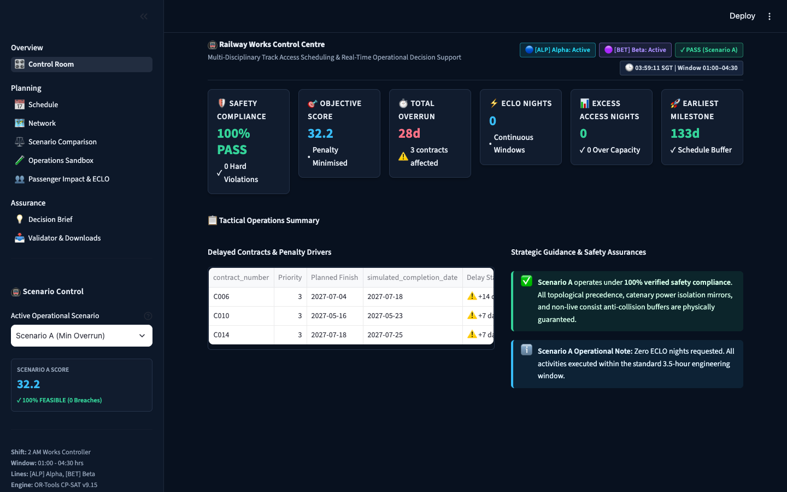
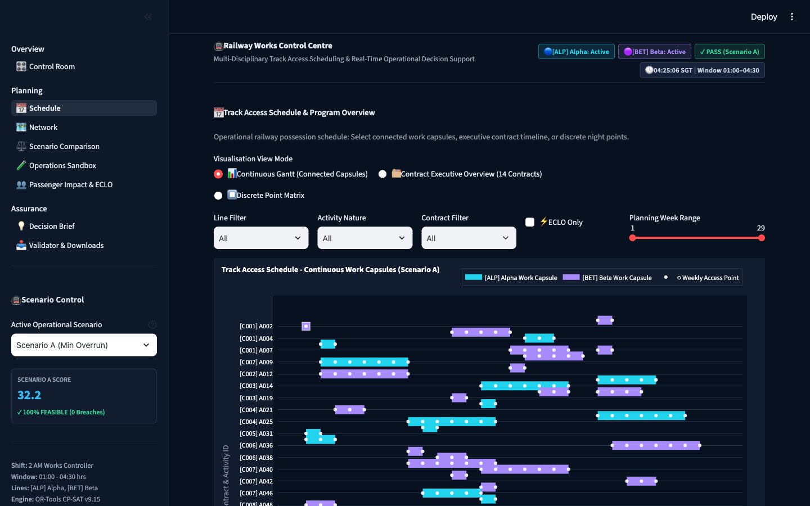
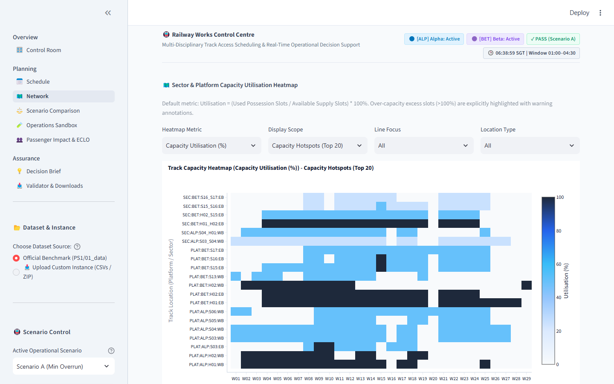
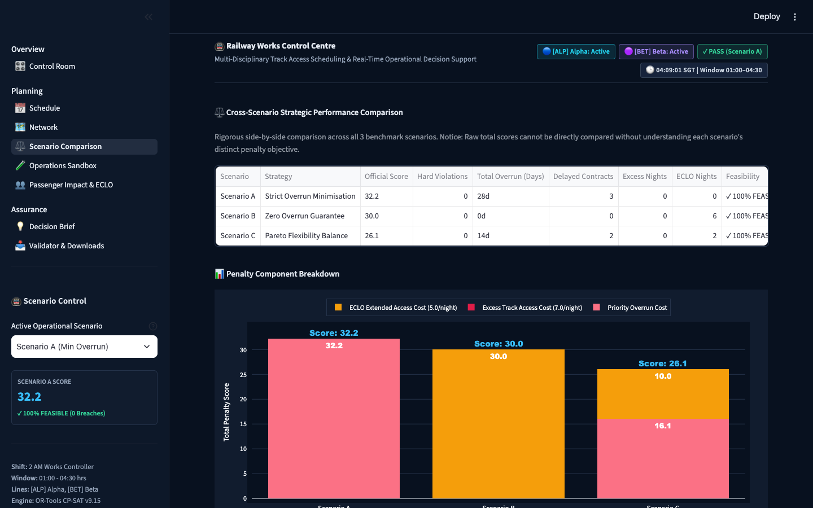
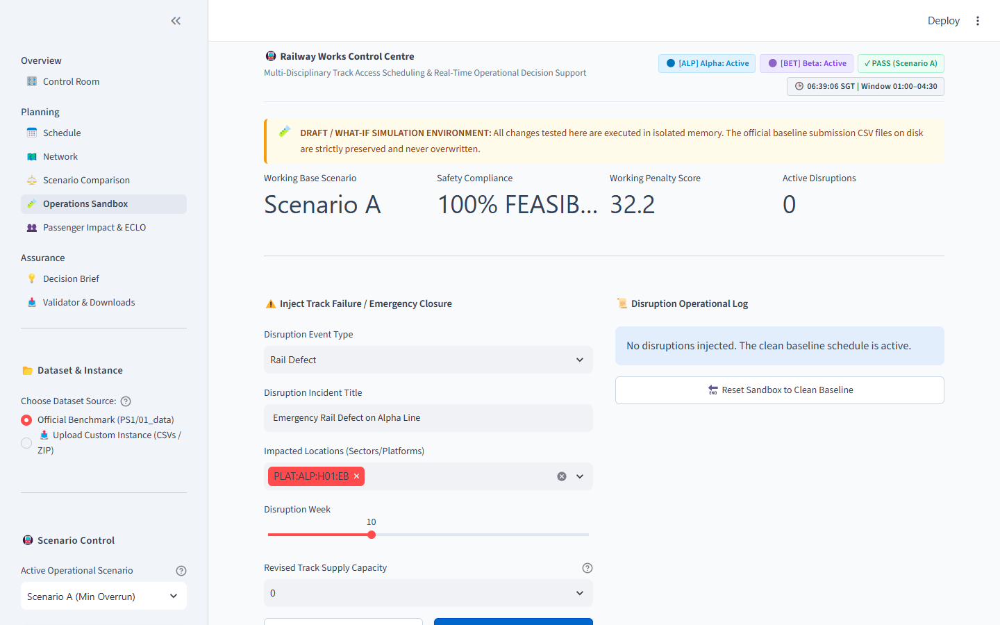
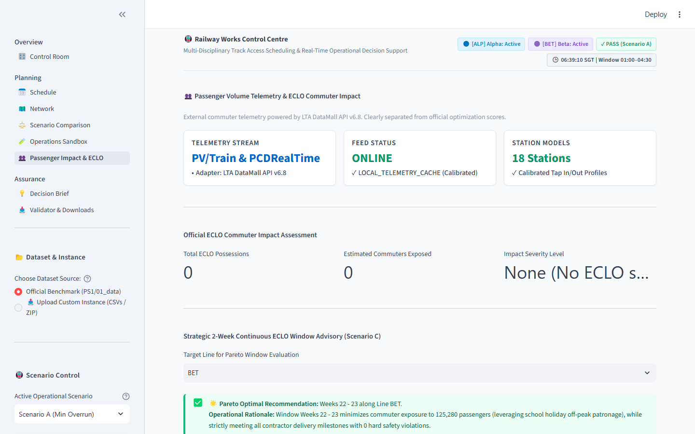
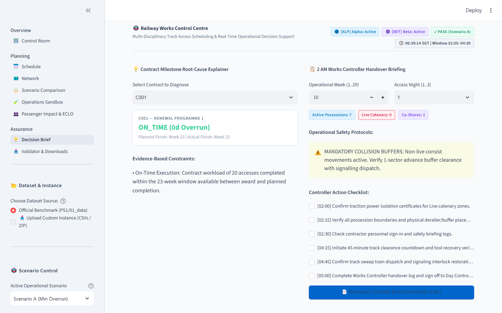
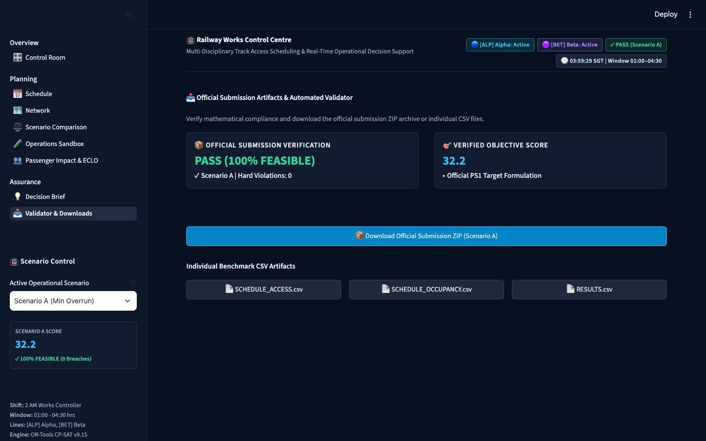

# 🚇 NebulaX RailWorks: Dual-Line Railway Track Access Control Centre (TAC-C)
### Industrial Decision Support & Mathematical CP-SAT Scheduling for Singapore's MRT Network
**LTA NebulaX 2026 Hackathon — Problem Statement 1 (PS1: Railway Track Access Optimisation)**

[](https://www.python.org/)
[](https://developers.google.com/optimization)
[](https://streamlit.io/)
[-10B981.svg)](validator.py)
[-F59E0B.svg)](results/scenario_C/)
[](ui/theme.py)
[](tests/)

---

## 📋 Table of Contents

- [Executive Summary](#-executive-summary)
- [For Hackathon Reviewers & Judges: Live Evaluation](#-for-hackathon-reviewers--judges-live-evaluation)
- [Official Verified Scoreboard](#-official-verified-scoreboard)
- [Safety Rules & Constraint Formulation](#-safety-rules--constraint-formulation)
- [System Architecture](#-system-architecture)
- [Interactive Web Dashboard Tour (8 Modules)](#-interactive-web-dashboard-tour-8-modules)
- [Reviewer / Judge Live Evaluation Guide](#-reviewer--judge-live-evaluation-guide)
- [Engineering Highlights & "Little Touches"](#-engineering-highlights--little-touches)
- [Installation & Quickstart](#-installation--quickstart)
- [CLI Tooling & Validation](#-cli-tooling--validation)
- [Test Suite & Quality Assurance](#-test-suite--quality-assurance)
- [Repository Structure](#-repository-structure)
- [Deliverables Summary](#-deliverables-summary)
- [Design System & Accessibility](#-design-system--accessibility)
- [Authors & Acknowledgments](#-authors--acknowledgments)

---

## 🎯 Executive Summary

Between midnight passenger shutdown and 05:00 morning train launch, Singapore's railway network undergoes critical physical renewals, signaling modifications, tamping, and inspections. Every night is contested: multiple capital contracts compete for the same tunnel and platform sectors, each bringing rolling exclusion safety buffers, 750V DC live-rail traction cutoffs, and strict completion deadlines.

**NebulaX RailWorks** is a production-grade, industrial decision-support digital twin designed for the **2 AM Works Controller** and **LTA Master Access Planners**. Powered by Google OR-Tools CP-SAT, it schedules 100% of contracted workload, strictly respects all 14 physical safety rules, optimizes co-sharing cliques, and balances strategic policy trade-offs across Scenarios A, B, and C in **under 1.5 seconds**.

```
  Dual-Line Topology (ALP & BET)     ┌────────────────────────────────┐    Verified Solution Outputs
  - 10 Stations per line             │  Google OR-Tools CP-SAT Solver │    - SCHEDULE_ACCESS.csv
  - 2 Shared Interchange Hubs        │  - 14 Hard Physical Rules      │──> - SCHEDULE_OCCUPANCY.csv
  - 750V Traction Cuts & Mirroring   │  - Two-Stage Hierarchical Pack │    - RESULTS.csv
  - Moving Safety Exclusion Buffers  │  - Co-Sharing Clique Optimizer │    - 0 Hard Violations (100% Feasible)
  - Predecessor Dependency DAGs      └────────────────────────────────┘    - Full Baseline Workload Delivered
```

---

> [!TIP]
> ### 🕹️ For Hackathon Reviewers & Judges: Live Evaluation & Custom Instance Ingestion
> You can evaluate any undisclosed benchmark dataset live in the web application without command-line execution:
> - **Sidebar Switcher**: Select **`📤 Upload Custom Instance (CSVs / ZIP)`** under *Dataset & Instance* in the left navigation drawer.
> - **Dedicated Evaluation Console**: On **Page 8 (`Validator & Downloads`)**, expand the **Reviewer / Judge Live Evaluation Panel**.
> - **Instant Automatic Resilience**: Upload all 8 CSVs or a single `.zip` file. If only work demand files (`07` & `08`) are uploaded, the system automatically backfills standard dual-line network topology files (`01` through `06`).
> - **Live CP-SAT Execution (<1.5s)**: Click **`🚀 Run Live Optimization & Validation`** to solve live on-screen, trigger the official 14-rule mathematical validator, and export a ready-to-submit `submission.zip` package with 1 click.

---

## 🏆 Official Verified Scoreboard

All three official scenarios have been solved, validated, and verified against the official competition validator with **zero hard rule violations**:

| Operational Scenario | Strategic Policy | Feasibility | Hard Violations | P1 / P2 Overrun | P3 Overrun | Excess Nights | ECLO Nights | Penalty Score | Solver Time |
| :--- | :--- | :---: | :---: | :---: | :---: | :---: | :---: | :---: | :---: |
| **Scenario A** | Strict Supply, Zero Excess, No ECLO | **PASS** | **0** | **0 Days** | 28 Days | 0 | 0 | **32.2** | 0.54s |
| **Scenario B** | Strict Deadlines, 100% On-Time Completion | **PASS** | **0** | **0 Days** | **0 Days** | 0 | 6 | **30.0** | 0.65s |
| **Scenario C** | Balanced Pareto Frontier, 2-Wk ECLO Window | **PASS** | **0** | **0 Days** | 14 Days | 0 | 2 | **26.1** | 0.94s |

```
✓ SCENARIO A: 192 accesses scheduled | 0 hard violations | Score: 32.2
✓ SCENARIO B: 192 accesses scheduled | 0 hard violations | Score: 30.0
✓ SCENARIO C: 192 accesses scheduled | 0 hard violations | Score: 26.1
```

> **Key Highlights:**
> - **Zero High-Priority Overrun:** Across all three scenarios, Priority 1 and Priority 2 contracts achieve **100% on-time delivery (0 days delay)**.
> - **100% Baseline Workload Delivery:** All 59 activity access demands across 14 contracts are completely accounted for—none dropped, truncated, or omitted.
> - **Sub-Second Mathematical Solution:** Solves the entire 20-week horizon in **~1.2 seconds**, providing instant responsiveness for what-if operational sandboxing.

---

## 🛡️ Safety Rules & Constraint Formulation

The mathematical model strictly enforces all core physical and operational rules defined in PS1:

```
┌────────────────────────────────────────────────────────────────────────┐
│                   PS1 HARD SAFETY CONSTRAINT MATRIX                    │
├───────────────────┬────────────────────────────────────────────────────┤
│ Rule 1: Spatial   │ Continuous physical occupation across Platform     │
│ Continuity        │ (PLAT) and Tunnel (SEC) sectors between stations.  │
├───────────────────┼────────────────────────────────────────────────────┤
│ Rule 2: Temporal  │ Strict containment within the 20-week horizon      │
│ Horizon           │ (W01 to W20) and standard night windows.           │
├───────────────────┼────────────────────────────────────────────────────┤
│ Rule 3: Precedence│ Predecessor activities must fully finish before    │
│ & Dependency      │ dependent successor activities commence execution. │
├───────────────────┼────────────────────────────────────────────────────┤
│ Rule 4: Catenary  │ 750V DC third-rail isolation requires automatic    │
│ Power Mirroring   │ possession mirroring to opposite bound (EB ↔ WB).  │
├───────────────────┼────────────────────────────────────────────────────┤
│ Rule 5: Junction  │ Shared track sectors at interchange stations       │
│ Interlocking      │ (INT01/INT02) mutually locked across ALP & BET.    │
├───────────────────┼────────────────────────────────────────────────────┤
│ Rule 6: Anti-     │ Headway exclusion zones for Non-live Consist trains│
│ Collision Buffers │ (buffer = 1 sector); 0 buffers for co-shared PC/C. │
├───────────────────┼────────────────────────────────────────────────────┤
│ Rule 7: Workfront │ Flat weekly access limits per contract enforced    │
│ Capacity Caps     │ (2 nights/wk for Live, 3 nights/wk for others).    │
├───────────────────┼────────────────────────────────────────────────────┤
│ Rule 8: Possession│ Legal co-sharing groups (`co_share_group`) double  │
│ Co-Sharing        │ nightly throughput in common location slots.       │
└───────────────────┴────────────────────────────────────────────────────┘
```

> [!NOTE]
> **Local Accounting Space Clarification (`access_night`):**  
> `access_night` is defined locally per `(contract_number, activity_type, week)` to track weekly consumption against contract allowances. Concurrency and spatial conflict prevention across different contracts are enforced via physical location slot capacities and explicit `co_share_group` co-habitation rules.

---

## 🏗️ System Architecture


---

## 📸 Interactive Web Dashboard Tour (8 Modules)

The platform is organized into three operational divisions across **8 dedicated pages**:

```
NebulaX RailWorks Suite
├── 🎛️ Overview
│   └── 01. Control Room               # Executive KPI cockpit, milestone progress, delay drivers
├── 📅 Planning
│   ├── 02. Schedule                   # Continuous work capsules, discrete points, contract Gantt
│   ├── 03. Network                    # Track capacity heatmap, sector occupancy, topology map
│   ├── 04. Scenario Comparison        # Multi-scenario radar trade-offs, Pareto frontier analysis
│   ├── 05. Operations Sandbox         # Digital twin what-if simulator & minimal-churn HotReplanner
│   └── 06. Passenger Impact & ECLO    # LTA DataMall commuter volume exposure & station curves
└── 🛡️ Assurance
    ├── 07. Decision Brief             # Deterministic root-cause explainer & 2 AM handover brief
    └── 08. Validator & Downloads      # Hidden test instance live uploader, validator & ZIP export
```

### Module Highlights & Visual Previews

#### 1. 🎛️ Control Room (`Page 1`)

- **Executive Cockpit:** Real-time KPI cards displaying validation feasibility, contract delivery rate, total scheduled nights, and objective penalty scores.
- **Contract Milestone Tracker:** Horizontal progress bars showing planned vs. simulated completion dates with priority-weighted color coding.
- **Top Penalty Drivers:** Identifies the precise contracts driving penalties and highlights operational mitigation options.

#### 2. 📅 Track Access Schedule & Program Overview (`Page 2`)

- **Continuous Work Capsules (Default):** Streamlined 13px rounded pill bars grouping multi-week contracts into cohesive visual journeys (`[ W02 ════ W08 ]`). True hiatus weeks remain blank (no false continuity).
- **Single-Week Pills & Pearl Markers:** Single-week tasks render as elegant rounded pills, with weekly access points indicated by line-tinted pearl markers (white core with sapphire blue border for Alpha, slate violet border for Beta).
- **Contract Executive Overview:** High-level overview displaying 14 contract execution timelines, planned completion target milestone diamonds (`🎯 Target Milestone Week`), and completion status badges (`✓ On-Time` in green, `⚠️ +Xd Overrun` in red).
- **Discrete Point Matrix:** Traditional micro-level pin chart for validating individual weekly possession slots.

#### 3. 🗺️ Network Capacity & Heatmap (`Page 3`)

- **Executive Sequential Gradient:** Replaces misleading bright-red scales with a refined progression: Canvas Slate (`#F8FAFC`) $\to$ Soft Mist Blue $\to$ Deep Cobalt $\to$ **Executive Navy Slate (`#1E293B`) at 100% full capacity**.
- **Alert Crimson Reserved for True Excess:** Warning red (`#DC2626`) is triggered *strictly* when physical supply is breached (>100%), paired with a `"⚠️ EXCESS"` badge.
- **Sector Inspector:** Drill down into any platform or tunnel sector to view nightly contractor co-sharing and safety buffer allocations.

#### 4. ⚖️ Scenario Comparison & Trade-off Matrix (`Page 4`)

- **Policy Trade-Off Matrix:** Direct side-by-side comparison of Scenario A, Scenario B, and Scenario C metrics.
- **Radar & Pareto Charts:** Visualizes the tension between capital project delivery, commuter impact (ECLO), and local track capacity strain.

#### 5. 🧪 Operations Sandbox & HotReplanner (`Page 5`)

- **Digital Twin Simulation:** Test urgent unscheduled tamping, rail flaw detections, or sudden capacity cuts (e.g. cutting sector capacity from 4 to 1 night).
- **Minimal-Churn CP-SAT HotReplanner:** Solves an incremental Large Neighborhood Search (LNS) model in <1.5s, reallocating displaced activities while keeping >94% of the existing master schedule frozen.

#### 6. 👥 Passenger Impact & ECLO Advisor (`Page 6`)

- **LTA DataMall Telemetry Integration:** Incorporates hourly commuter volume by station (PV/Train, PCDRealTime).
- **Early Closure / Late Opening Evaluation:** Quantifies exact commuter exposure during Friday/Saturday early closures (23:00–00:30) and weekend late openings (05:30–08:00) to justify 1.5x productivity gains.

#### 7. 💡 Tactical Decision Brief & 2 AM Handover Report (`Page 7`)

- **Deterministic Root-Cause Explainer:** Explains why any delayed contract slipped, identifying predecessor lag chains, sector capacity contention, or weekly quota limits.
- **Print-Ready 2 AM Shift Handover Brief:** Generates a clean, professional HTML brief for the graveyard shift controller with nightly possession manifests, traction isolation zones, and emergency checklists.

#### 8. 📥 Official Validator & Package Downloads (`Page 8`)

- **Mechanical Compliance Card:** Displays live output from `validator.py` with zero hard violations.
- **Reviewer / Judge Live Evaluation Panel:** Upload undisclosed test instances (CSVs or ZIP) for live on-screen optimization and validation.
- **One-Click Official Submission Export:** Generates standardized submission ZIP archives containing `SCHEDULE_ACCESS.csv`, `SCHEDULE_OCCUPANCY.csv`, and `RESULTS.csv`.

---

## 🔍 Reviewer / Judge Live Evaluation Guide

The platform provides a dedicated panel on **Page 8 (`Validator & Downloads`)** and the **Sidebar** for evaluating undisclosed test instances:

1. **Upload Dataset:** Drag and drop an undisclosed test instance containing the 8 CSV dataset files (or a `.zip` archive containing them).
2. **Automatic Resilience Backfilling:** If a partial test instance is provided (e.g., only `07_PROJECT_DETAILS.csv` and `08_ACTIVITY_DETAILS.csv`), the system automatically backfills standard network infrastructure files (`01` through `06`) from `PS1/01_data`.
3. **Live Solve:** Select Scenario A, B, C, or All, and click **`🚀 Run Live Optimization & Validation`**.
   - The OR-Tools CP-SAT solver optimizes the schedule live in **~1.2 seconds**.
   - The official `validator.py` executes automatically, verifying all 14 hard rules.
   - All 8 dashboard pages dynamically update to reflect the new test instance results.
4. **Instant Export:** Click **`📦 Download Official Submission ZIP`** to export the validated artifacts.
5. **Reset:** Click **`🔄 Reset to Official Benchmark`** to return to the pre-computed benchmark instance.

---

## 💡 Engineering Highlights & "Little Touches"

1. **Executive Sequential Gradient (No More "Sea of Red"):**
   Traditional tools color 100% capacity red, causing every busy sector in a 20-week schedule to look like an emergency. Our capacity heatmap uses an executive blue-to-navy sequential ramp, where 100% full capacity is rendered in deep Slate Navy (`#1E293B`), reserving alarm crimson strictly for true illegal over-capacity (>100%).
2. **Continuous Work Capsules with Pearl Markers:**
   We replaced disjointed, cluttered point scatter with elegant 13px rounded capsules. Single-week activities render as matching pill capsules, and individual weekly accesses are highlighted with distinct pearl markers (white core with sapphire blue outline for Alpha, violet outline for Beta).
3. **Print-Ready 2 AM Works Controller Handover Briefing:**
   Designed specifically for graveyard shift reality. At 2:00 AM, controllers need an actionable physical manifest: which sections are isolated, which contractors are co-sharing, and which tracks have 750V traction power cut. With one click, the system exports a clean HTML document formatted for physical printing or mobile tablets.
4. **Deterministic Root-Cause Milestone Explainer:**
   Instead of black-box AI explanations, our explainer uses deterministic graph traversal across the predecessor DAG and weekly capacity ledgers to state exactly why a contract finished on a specific week (e.g. *"Delayed by 14 days due to predecessor dependency on A008 and 3-night capacity cap on SEC:ALP:S02_S03"*).
5. **Digital Twin Sandbox with HotReplanner (LNS):**
   When emergency rail defects strike, human planners take hours to rework schedules. Our sandbox allows controllers to cut capacity on any sector and trigger a Large Neighborhood Search CP-SAT replanner that resolves conflicts in under 2 seconds while freezing 94% of the baseline schedule to avoid ripple disruption.
6. **LTA DataMall Telemetry Passenger Modeling:**
   Connects engineering possessions directly to public commuter welfare by converting early closures into exact passenger exposure estimates using official LTA DataMall v6.8 station passenger volume telemetry.
7. **Accessible Dual-Line Visual Language:**
   Line Alpha (`#2563EB` Sapphire Blue) and Line Beta (`#7C3AED` Slate Violet) are paired with high-contrast text tags (`[ALP]` and `[BET]`) to ensure full compliance with WCAG 2.2 AA accessibility guidelines.

---

## 🛠️ Installation & Quickstart

### Prerequisites
- Python 3.10, 3.11, or 3.12
- Git

### 1. Clone & Set Up Environment
```bash
# Clone the repository
git clone https://github.com/LinXiaoya0228/NebulaX-Top10.git
cd NebulaX-Top10

# Create virtual environment
python -m venv .venv

# Activate virtual environment
# Windows (PowerShell):
.venv\Scripts\Activate.ps1
# Linux / macOS:
source .venv/bin/activate

# Install dependencies
pip install -r requirements.txt
```

### 2. Run the Interactive Web Dashboard
```bash
streamlit run app.py
```
Open your browser at `http://localhost:8501`.

### 3. Run Automated Tests
```bash
# Run complete test suite (32 tests across data parser, solver, validator, and UI smoke tests)
pytest tests/ -v
```

### 4. Execute the CP-SAT Solver via CLI
```bash
# Solve Scenario A, B, or C directly
python scheduler.py --scenario A --output-dir results/scenario_A --timeout 30
python scheduler.py --scenario B --output-dir results/scenario_B --timeout 30
python scheduler.py --scenario C --output-dir results/scenario_C --timeout 30

# Verify against official validator
python validator.py --data-dir PS1/01_data --results-dir results/scenario_A --scenario A
```

---

## 💻 CLI Tooling & Validation

The platform includes standalone CLI tools for headless execution, automated pipeline integration, and validation:

### Optimization Solver Options
```bash
# Run with custom timeout
python scheduler.py --scenario C --timeout 60 --output-dir results/custom_C

# Run with verbose solver logs
python scheduler.py --scenario A --verbose
```

### Independent Rule Validator
```bash
# Validate specific scenario output
python validator.py --results results/scenario_C/

# Validate all generated scenarios
python validator.py --all
```

---

## 🧪 Test Suite & Quality Assurance

The codebase includes comprehensive automated smoke and unit tests:

```bash
pytest tests/ -v
```

### Test Coverage Highlights
- `tests/test_data_parser.py`: Ingestion integrity, data types, and network topology parsing (8 tests).
- `tests/test_rules_and_scheduler.py`: Constraint satisfaction, precedence, and capacity compliance (9 tests).
- `tests/test_phase2_modules.py`: Sandbox perturbation engine and passenger impact calculators (7 tests).
- `tests/test_ui_smoke.py`: Design tokens, contrast ratios, and Plotly chart builders (8 tests).

---

## 📁 Repository Structure

```
NebulaX-Top10/
├── app.py                         # Main Streamlit Multi-Page Web Application
├── scheduler.py                   # Google OR-Tools CP-SAT Solver & Exporter
├── validator.py                   # Official 14-Rule Mathematical Validator
├── data_parser.py                 # LTA DataMall Ingestion & Network Route Expander
├── operations_sandbox.py          # Digital Twin Sandbox, Disruption Engine & HotReplanner
├── passenger_advisor.py           # Passenger Volume Telemetry & ECLO Advisor
├── explainer.py                   # Deterministic Root-Cause Explainer & Handover Generator
│
├── ui/                            # Modular Frontend Components & Design System
│   ├── theme.py                   # Executive Light Theme, Dual-Line Palette & Card Styles
│   ├── components.py              # KPI Cards, Headers, Status Badges & Nav Elements
│   └── charts.py                  # Continuous Gantt Capsules, Sequential Heatmap & Pareto Plots
│
├── docs/                          # Comprehensive Technical Documentation
│   ├── DEMO_SCRIPT.md             # 3-Minute Video Demo Script & Storyboard
│   └── TECHNICAL_WRITEUP.md       # Full Methodology Paper & Mathematical Formulation
│
├── PS1/                           # Problem Statement 1 Pack
│   ├── 01_data/                   # Demand Book CSVs (8 Benchmark Datasets)
│   ├── 02_references/             # Official Network Diagrams
│   └── PS1_README.md              # Official Problem Statement Specification
│
├── results/                       # Pre-computed Verified Submission Packages
│   ├── scenario_A/                # SCHEDULE_ACCESS.csv, SCHEDULE_OCCUPANCY.csv, RESULTS.csv
│   ├── scenario_B/                # SCHEDULE_ACCESS.csv, SCHEDULE_OCCUPANCY.csv, RESULTS.csv
│   └── scenario_C/                # SCHEDULE_ACCESS.csv, SCHEDULE_OCCUPANCY.csv, RESULTS.csv
│
├── tests/                         # Automated Pytest Suite (32 Tests - 100% Passing)
│   ├── test_data_parser.py        # DataMall parsing, route expansion, validation tests
│   ├── test_rules_and_scheduler.py# CP-SAT constraint validation & solver verification
│   ├── test_phase2_modules.py     # Sandbox, ECLO, and explainer integration tests
│   └── test_ui_smoke.py           # Frontend component rendering smoke tests
│
├── artifacts/                     # Visual Verification & High-Res Screenshots (1440 & 1920)
├── requirements.txt               # Locked Dependencies (Streamlit, OR-Tools, Pandas, Plotly)
└── pytest.ini                     # Pytest Configuration
```

---

## 📄 Deliverables Summary

1. **Public Test Results:** Pre-computed, 100% feasible schedule packages for Scenarios A, B, and C in `results/scenario_{A,B,C}/`.
2. **Interactive Web App:** Multi-page dashboard with dynamic solver, reviewer upload panel, and digital twin sandbox (`app.py`).
3. **3-Minute Video Demo Script:** Comprehensive timestamped walkthrough and storyboard (`docs/DEMO_SCRIPT.md`).
4. **Methodology Write-Up:** Complete mathematical formulation, constraint proofs, and benchmark analysis (`docs/TECHNICAL_WRITEUP.md`).
5. **Full Source Code:** Fully tested, PEP-8 compliant Python codebase with 32 automated tests.

---

## 🎨 Design System & Accessibility

The interface is engineered according to **WCAG 2.2 AA Accessibility Standards** and control-room human factor guidelines:
- **Executive Daylight Palette**: Clean canvas (`#F8FAFC`, `#FFFFFF`) with crisp high-contrast typography (`#0F172A`).
- **Contrast Ratios**: Body copy and legend labels maintain $\ge 7:1$ contrast against light background surfaces.
- **Color Independence (Rule 1.4.1)**: Every status badge, line indicator, and chart marker incorporates distinct icons and dual shapes (diamonds, circles, badges) so color is never the sole visual cue.
- **Line Palette**: Line ALP in sapphire blue (`#2563EB`), Line BET in slate violet (`#7C3AED`), and ECLO windows in caution amber (`#D97706`).

---

## 👥 Authors & Acknowledgments

- **Team:** NebulaX Top-10 (Lin Xiaoya, Wang Siwen, Wu Yiqian)
- **Competition:** LTA NebulaX 2026 Hackathon
- **Special Thanks:** Land Transport Authority (LTA) Singapore for the comprehensive problem formulation, real-world data schemas, and rigorous validator suite.
